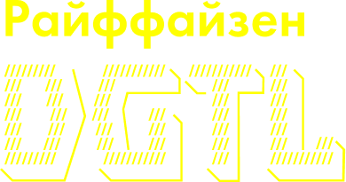

# JAVA HACK Хакатон для Java-разработчиков

  

* **Даты проведения**: 14-15 сентября 2019 года
* Хакатон для начинающих Java-разработчиков, дизайнеров, аналитиков и менеджеров digital-продуктов.
* **Задача участников**: за 2 дня разработать прототип цифрового решения для клиентов банка с интеграцией сторонних сервисов.

# Презентации от организоторов (предварительный анализ и задача)

1. [Формулировка задачи, критерии, etc](./presentations/RBRU_JavaHack_deck_v4.pdf)
2. [Анализ: Обзор рынка SME & физюриков](./presentations/Java_Hack_opros_FizYuriki.pdf)
3. [Анализ: Физикоюрики U&A](./presentations/Java_Hack_analitika_po_SME_final.pdf)

# Наша команда

1. [Денис Меркушин](https://github.com/DenRUS) Backend-разработчик
2. [Сергей Курочкин](https://github.com/kurochkinSergei) Frontend-разработчик
3. [Максим Шевченко](https://github.com/maks-sh) Продукт-менеджер, аналитик